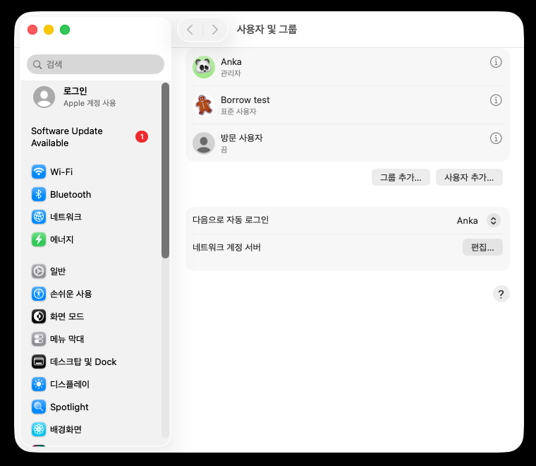
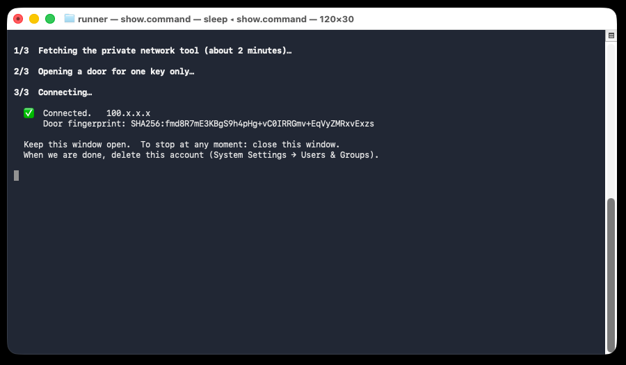

# 맥 잠깐 빌려주기

새 계정 하나 만들고, 받은 한 줄을 붙여 넣으면 끝. 비밀번호를 알려 줄 일은 없어요.

## 1. 새 계정 만들기

시스템 설정 → **사용자 및 그룹** → **사용자 추가…** · 종류는 **표준**, 이름은 **borrow**



## 2. 받은 한 줄 붙여 넣기

**⌘ + 스페이스** → "터미널" → 메시지로 받은 한 줄을 붙여 넣고 Enter.
`Ready` 가 뜨면 그 창은 닫아도 돼요.

## 3. 새 계정에서 열기

 메뉴 → **잠금 화면** → **borrow** 로 로그인 → 터미널을 열고 이것만 입력하고 Enter.

```
/Users/Shared/borrow.command
```

2분쯤 뒤 **✅ Connected** 가 뜨면 된 거예요. 그 창은 열어 두세요.



## 4. 끝나면

터미널 창을 닫고, 원래 계정에서 **사용자 및 그룹 → borrow 옆 ⓘ → 사용자 삭제 → 홈 폴더 삭제**.

---

**안심해도 되는 까닭**

- 새 계정은 표준 계정이라 내 파일·사진·비밀번호에 닿지 못해요.
- 터미널 창을 닫는 순간 바로 끊겨요.
- 설치되는 것은 전부 새 계정 안에만. 계정을 지우면 다 사라져요.
- 실행되는 스크립트는 [friend.sh](friend.sh) 하나예요. 이 과정 전체를 [깨끗한 맥에서 돌려 본 기록](https://github.com/philaxis/flick/actions/workflows/rehearsal.yml)도 있어요.
